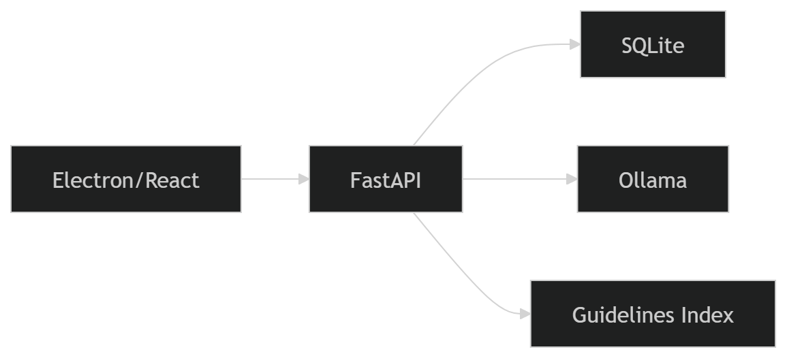
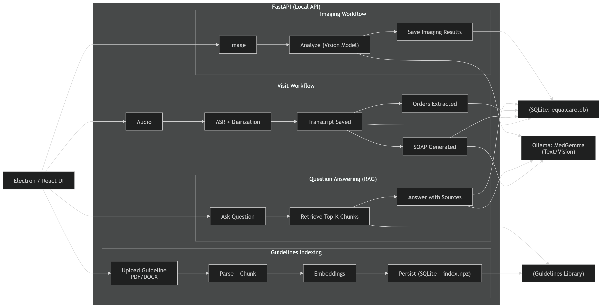

# 🩺 EqualCare

**EqualCare** is an **offline-first desktop clinical assistant** that helps clinicians turn a patient visit into:

- **Transcript** (with speaker diarization)
- **SOAP summary**
- **Auto-extracted medical orders**

It also supports **guideline-based Q&A (RAG with citations)** and **basic imaging analysis** — all running locally.

---

## ✨ Features

- 🎙️ **Transcription**: Convert recorded WAV audio into a visit transcript (with speaker diarization).
- 🧾 **SOAP Notes**: Generate structured SOAP summaries from the transcript.
- 🧪 **Auto Orders**: Extract clear, explicit orders (labs, meds, imaging, procedures) from the transcript.
- 📚 **Guidelines RAG**: Ask questions and get protocol-aligned answers with references from uploaded guideline files (PDF/DOCX/TXT).
- 🩻 **Imaging Analysis**: Upload an image (e.g., X-ray) and generate a local AI description, with history saved.

---

## 🛠️ Tools & Technologies

- **Desktop**: Electron
- **UI**: React + TypeScript + Vite
- **Backend**: FastAPI (Python)
- **Database**: SQLite (local)
- **Local AI**:
  - **MedGemma** — clinical Q&A / summarization / imaging analysis (Ollama)
  - **MedASR** — transcription (ASR)
  - **pyannote/speaker-diarization-3.1** — speaker diarization
  - **sentence-transformers/all-MiniLM-L6-v2** — embeddings for guideline retrieval (RAG)

---

## 📂 Project Structure

```text
equalcare/
├─ electron/                 # Electron main/preload
├─ src/                      # React UI
│  ├─ pages/                 # Dashboard, Patients, Notes, Orders, Assistant, Imaging...
│  └─ components/
├─ backend/                  # FastAPI services + local DB logic
│  ├─ main.py                # API routes
│  ├─ db.py                  # SQLite schema + queries
│  ├─ paths.py                # Local filesystem paths
│  ├─ transcript_service.py  # diarization + transcription
│  ├─ notes_service.py       # SOAP generation
│  ├─ orders_service.py      # auto order extraction
│  ├─ assistant_service.py    # Q&A
│  ├─ guidelines_service.py  # persistent guidelines RAG
│  └─ image_service.py       # imaging analysis
└─ electron-builder.json5    # Windows build config
```
---
## 🏗️ Architecture


---

---
## ⚙️ Setup Instructions (Development)

### 1) Prerequisites
- Node.js 18+
- Ollama

---

### 2) Create the project (only if starting from scratch)
If you want to scaffold a new Electron + Vite desktop app:

```bash
npm create electron-vite@latest equalcare
```

In the wizard choose:
- **Framework:** React
- **Variant:** TypeScript

Then:

```bash
cd equalcare
npm install
npm run dev
```

---

### 3) Install dependencies
From the project root:

```bash
# Frontend + Electron
npm i lucide-react

# Backend (create venv recommended)
python -m venv backend/.venv

# Windows (PowerShell)
backend\.venv\Scripts\Activate.ps1

pip install -r backend/requirements
```

> **Note (Windows stability):**  
> If you face crashes after installing requirements, try removing `torchcodec`.  
> `torchcodec` caused crashes on some Windows setups (FFmpeg/version issues).
>
> ```bash
> pip uninstall -y torchcodec
> ```

---

### 4) Pull default Ollama models
```bash
# Assistant (LLM)
ollama pull MedAIBase/MedGemma1.0:4b

# Imaging (Vision)
ollama pull thiagomoraes/medgemma-1.5-4b-it:Q4_K_S
```
---

### 5) Run the backend
From the project root:

```bash
python -m uvicorn backend.main:app --reload --host 127.0.0.1 --port 8000
```

---

### 6) Run the desktop app (UI)
In another terminal:

```bash
npm run dev
```


## 🔐 Privacy

All data is stored locally on the machine (SQLite + local files). No cloud dependency is required.


## ⚠️ Medical Disclaimer

This tool is for workflow assistance only and does not replace clinical judgment.


## 📄 License
MIT
